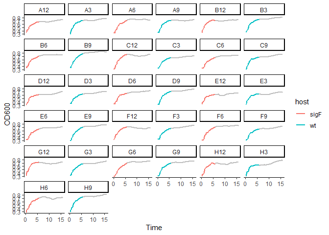
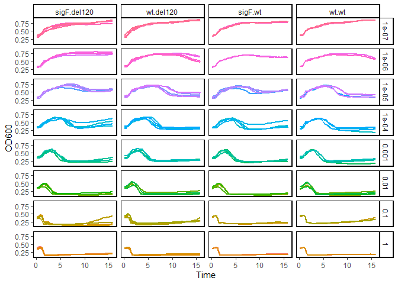

Virulence index
================

``` r
library(here)
```

    ## here() starts at C:/Users/danschw/GitHub/spore-phage-sigma

``` r
library(tidyverse)
```

    ## -- Attaching packages --------------------------------------- tidyverse 1.3.0 --

    ## v ggplot2 3.3.3     v purrr   0.3.4
    ## v tibble  3.1.0     v dplyr   1.0.5
    ## v tidyr   1.1.3     v stringr 1.4.0
    ## v readr   1.4.0     v forcats 0.5.1

    ## -- Conflicts ------------------------------------------ tidyverse_conflicts() --
    ## x dplyr::filter() masks stats::filter()
    ## x dplyr::lag()    masks stats::lag()

``` r
library(lubridate)
```

    ## 
    ## Attaching package: 'lubridate'

    ## The following objects are masked from 'package:base':
    ## 
    ##     date, intersect, setdiff, union

``` r
library(broom)
library(cowplot)
```

    ## 
    ## Attaching package: 'cowplot'

    ## The following object is masked from 'package:lubridate':
    ## 
    ##     stamp

``` r
library(scales)
```

    ## 
    ## Attaching package: 'scales'

    ## The following object is masked from 'package:purrr':
    ## 
    ##     discard

    ## The following object is masked from 'package:readr':
    ## 
    ##     col_factor

``` r
library(growthcurver)
library(caTools) #needed for trapezoids
source(here("virulence/code/virulence_functions.R"))
```

# The virulence index

Based on paper *Storms, Zachary J., et al. “The Virulence Index: A
Metric for Quantitative Analysis of Phage Virulence.” PHAGE 2019*

I want to commpare SP10 WT to the *Δ**g*120 on both the WT host (*Δ*6)
anf its *Δ*6*Δ**s**i**g**F* derivative.

I ran the experiments twice. In the first run I made a mistake in the
columns to which the phages were added. This resulted in having complete
data from that experiment only for SP10 *Δ**g*120. Below I analyze the
data from both experiments.

## load and organize data

colonies of first experiment labeled \#1 and \#2. From second experiment
labeled \#3 and \#4

``` r
# read file experiment 1
input <- 
  read_synergy_txt(here("virulence/data/20190823_SP10_VIndx.txt")) %>% 
  # In these files there are reads every 2 min. 
  # I will average on window of 8 reads
  smooth_synergy_txt(raw_input = . , window_size = 8)

#transform to long format
d <- gather(input, key="well", value = "OD600", colnames(input)[-c(1:2)])

#add metadata
meta <- read_csv(here("virulence/data/20190823_meta.csv"))
```

    ## 
    ## -- Column specification --------------------------------------------------------
    ## cols(
    ##   well = col_character(),
    ##   row = col_character(),
    ##   col = col_double(),
    ##   host = col_character(),
    ##   colony = col_double(),
    ##   phage = col_character(),
    ##   dilution = col_double()
    ## )

``` r
d <-merge(d, meta, by = "well")

# read file experiment 1
input <- 
  read_synergy_txt(here("virulence/data/20190826_SP10_VIndx.txt")) %>% 
  # In these files there are reads every 2 min. 
  # I will average on window of 8 reads
  smooth_synergy_txt(raw_input = . , window_size = 8)

#add metadata
meta <- read_csv(here("virulence/data/20190826_meta.csv"))
```

    ## 
    ## -- Column specification --------------------------------------------------------
    ## cols(
    ##   well = col_character(),
    ##   row = col_character(),
    ##   col = col_double(),
    ##   host = col_character(),
    ##   colony = col_double(),
    ##   phage = col_character(),
    ##   dilution = col_double()
    ## )

``` r
#transform to long format
d <- 
  gather(input, key="well", value = "OD600", colnames(input)[-c(1:2)]) %>% 
  merge(., meta, by = "well") %>% 
  bind_rows(d, .)
```

## Examine and clean data

``` r
d%>%
  # filter(host != "blank")%>%
  ggplot(aes(x=Time, y=OD600))+
  geom_line(aes(group= interaction(well,colony),
                color=as.character(dilution)), size=1)+
  facet_grid(host~phage)+
  theme_cowplot()+
  panel_border()+
  scale_color_viridis_d()+
  theme(legend.position = "bottom")
```

<!-- -->

Overall, there is a good dilution dependence in the timing of bacterial
growth reduction (i.e. lysis). There appear to be a contaminated blank
control, and perhaps some wells that did not receive phage in the
highest phage dilutions. This is expected.

``` r
d%>%
  filter(host == "blank")%>%
  ggplot(aes(x=Time, y=OD600))+
  geom_line( size=1)+
  facet_wrap(well~colony, strip.position = "r" )+
  theme_classic()+
  panel_border()+
  scale_color_viridis_d()+
  theme(legend.position = "bottom")
```

<!-- -->

single blank contamination. Not bad. Moving on.

## Calculating the viruence index

Folowing Storms et. al.  
*1. establish limit of integration* *“It is important to stress how the
establishment of the limit of integration plays a significant role in
the assessment of virulence. This limit should be set as the onset of
stationary phase in the phage-free control. This provides a consistent
reference for integration that can be easily identified for any
phage–host system and restricts measurements to the period of cell
growth—a necessary condition for productive infection for many phages.47
Moreover, it ensures that the range of the virulence measurements is
well distributed, as discussed hereunder. In general, we recommend
establishing the limit of integration as the time at which the slope of
OD630 over time reaches ≤0.03 h.”*

### Determining the integration limit

Doing this can be done in 2 ways:  
\#\#\#\# A.using ‘growthcurver’ to find no-phage carying capacity (k)

``` r
k.noPHI <- 
  d %>%
  filter(host != "blank")%>%
  filter(phage=="noPHI") %>% 
  mutate(well_col = paste(well, colony, sep="_")) %>% 
  select(well_col, Time, OD600) %>% 
  pivot_wider(names_from = well_col, values_from = OD600) %>% 
  #focus on time before OD decline
  filter(Time < 7) %>%
  # derive growth parameters with "growthcurver"   
  SummarizeGrowthByPlate(., bg_correct = "none")%>%
  select(well_col = sample, k)

# add data on host colony
k.noPHI <-
  d %>%
  mutate(well_col = paste(well, colony, sep="_")) %>% 
  select(well_col, host, colony) %>% 
  distinct() %>% 
  left_join(k.noPHI, ., by = "well_col")

# for each of the non-infected wells we now find the time it reached carrying capacity

# add column to store time
k.noPHI$Time.k <- NA

for(i in seq(k.noPHI$well_col)){
  w <- k.noPHI$well_col[i]
  k <- k.noPHI$k[i]
  tmp <- 
    d%>%
    mutate(well_col = paste(well, colony, sep="_")) %>% 
    filter(well_col==w) %>% 
    arrange(Time)
  
  k.noPHI$Time.k[i] <-
    tmp$Time[which(tmp$OD600>k)[1]]
  
}
#remove loop vars
rm(tmp, i,w,k)

# use the median time found
int.limit <- median(k.noPHI$Time.k, na.rm = TRUE)

k.noPHI %>% 
  ggplot(aes(host, Time.k)) +
  geom_boxplot(fill="grey80")+
  geom_jitter(width = 0.1, shape=21, size=2, fill="white")+
  geom_hline(yintercept = int.limit)+
  labs(caption = paste("median time to K = ", int.limit, "h"))+
  theme_classic()+
  panel_border(color = "black")
```

    ## Warning: Removed 3 rows containing non-finite values (stat_boxplot).

    ## Warning: Removed 3 rows containing missing values (geom_point).

<!-- -->

#### B. by visual inspection of plots

First I will look at the change in OD over time. Storms et al. recommend
*establishing the limit of integration as the time at which the slope of
OD630 over time reaches ≤0.03 h*

``` r
time.diff <- diff(d$Time[1:2])

d %>% 
  filter(phage=="noPHI")%>%
  mutate(well_col = paste(well, colony, sep="_")) %>% 
  split(.$well_col)%>% 
  map_df("OD600")%>%
  map_df(diff)%>%
  map_df(function(x) x/time.diff)-> tmp

matplot(x= unique(d$Time)[-60],tmp, type="l", ylab = "OD/Time diff")
abline(h=0.03, col="red", lwd=3)
abline(v=c(1:floor(max(d$Time))), col="grey")
```

<!-- -->

This method show that the integrating limit should be at \~ 5 hours.
Taking both together I will set integration limit at 6 hours. How does
that look?

``` r
int.limit <- 6

d%>%
  filter(phage=="noPHI")%>%
  filter(colony %in% c(1:2))%>%
  filter(Time<int.limit)%>%
  ggplot(aes(x=Time, y=OD600))+
  geom_line(data=filter(d,phage=="noPHI") %>% 
              filter(colony %in% c(1:2)), color="grey", size=1)+
  geom_line(aes(color=host), size=1)+
  facet_wrap(~well)+
  theme_classic()
```

<!-- -->

``` r
d%>%
  filter(phage=="noPHI")%>%
  filter(colony %in% c(3:4))%>%
  filter(Time<int.limit)%>%
  ggplot(aes(x=Time, y=OD600))+
  geom_line(data=filter(d,phage=="noPHI") %>% 
              filter(colony %in% c(3:4)), color="grey", size=1)+
  geom_line(aes(color=host), size=1)+
  facet_wrap(~well)+
  theme_classic()
```

<!-- -->

Looks OK to me.

## Choosing the dilution range

Need to make sure to use only dilutions in which all wells got phage.

``` r
phage.vol <- 0.1 #ml
init.titer <- 1e9 #PFU/ml
max.dilut <- 1/(init.titer*phage.vol)
#-# verify visualy
d%>%
  mutate(well_col = paste(well, colony, sep="_")) %>% 
  filter(host != "blank")%>%
  filter(phage!="noPHI")%>%
  ggplot(aes(x=Time, y=OD600))+
  geom_line(aes(color=well_col), size=1)+
  facet_grid(dilution~interaction(host, phage))+
  theme_classic()+
  panel_border(color = "black")+
  theme(legend.position = "none")
```

<!-- -->

I think 1e-5 is the limit, maybe 1e-6. Closer look:

``` r
d%>%
  filter(host != "blank")%>%
  filter(phage!="noPHI")%>%
  filter(dilution==1e-7 |dilution==1e-6 |dilution==1e-5)%>%
  ggplot(aes(x=Time, y=OD600))+
  geom_line(aes(color=well), size=1)+
  facet_grid(dilution~interaction(host, phage))+
  theme_cowplot()+
    theme(legend.position = "none")
```

<!-- -->

``` r
max.dilut <-1e-6
```

I think 1e-6 is pretty safe to say all dilutions recieved phage.

## Integrate the area under curve

Storms et al.: *"areas underneath the optical density versus time curves
were calculated using the trapezoid rule for each well, from the time of
infection to the time corresponding to the onset of stationary phase in
the phage-free control*

``` r
meta <- 
  d %>% 
  select(-OD600, -Time, -temp) %>% 
  distinct() %>% 
  mutate(well_col = paste(well, colony, sep="_"))

meta$auc <- NA
for(i in seq(meta$well_col)){
  if(meta$host[i]=="blank") next

  tmp <- 
    d%>%
    mutate(well_col = paste(well, colony, sep="_")) %>% 
    filter(well_col==meta$well_col[i])%>%
    filter(Time<=int.limit)
  meta$auc[i] <- trapz(tmp$Time, tmp$OD600)
    
}
rm(tmp)

# summarize no phage control areas
sum.noPHI <- 
  meta%>%
    filter(host != "blank")%>%
    filter(phage=="noPHI")%>%
    group_by(host, colony)%>%
    summarise( A0=mean(auc), sd=sd(auc))
```

    ## `summarise()` has grouped output by 'host'. You can override using the `.groups` argument.

``` r
# sum.noPHI %>%
  # ggplot(aes(colony, A0))+
  # geom_pointrange(aes(ymin=A0-sd, ymax=A0+sd))+
  # facet_wrap(~host)

vindex <- merge(meta, sum.noPHI)
vindex$Vi <- 1-(vindex$auc/vindex$A0)
vindex$log.moi <- log10(vindex$dilution*100)

vindex%>%
  filter(phage != "noPHI") %>% 
  filter(dilution>=max.dilut)%>%
  group_by(host,colony, phage, log.moi)%>%
  summarise( Virulence=mean(Vi), mn=min(Vi), mx=max(Vi), n=n())%>%
  mutate(colony = as.character(colony)) %>% 
    ggplot(aes(log.moi, Virulence, color=colony))+
      geom_line(aes(group=colony), size=1)+
      geom_pointrange(aes(ymin=mn, ymax=mx ), shape=21, size=.5, fill = "white")+
      facet_wrap(phage~host, nrow=2,labeller = "label_both")+
      theme_classic()+
      panel_border(color="black")+
      scale_colour_viridis_d()
```

    ## `summarise()` has grouped output by 'host', 'colony', 'phage'. You can override using the `.groups` argument.

<!-- -->

## summarize to single value index

Storms et al.: *The virulence index is defined as the area under the
virulence curve (AP) divided by the theoretical maximum area under the
virulence curve (Amax)* **Vp = Ap / Amax**

``` r
sum.phi <- vindex%>%
  filter(phage!="noPHI")%>%
  group_by(host,colony, phage)%>%
  summarise(  n=n())
```

    ## `summarise()` has grouped output by 'host', 'colony'. You can override using the `.groups` argument.

``` r
sum.phi$Ap <- NA
sum.phi$Amax <- NA
for(i in seq(nrow(sum.phi))){
 
  tmp <- 
    vindex%>%
    filter(phage!="noPHI")%>%
    filter(host==sum.phi$host[i])%>%
    filter(colony==sum.phi$colony[i])%>%
    filter(phage==sum.phi$phage[i])%>%
    filter(dilution>=max.dilut)%>%
    arrange(log.moi)
  sum.phi$Ap[i] <- trapz(tmp$log.moi, tmp$Vi)
  sum.phi$Amax[i] <-  trapz(tmp$log.moi,rep(1, nrow(tmp)))
  
}

rm(tmp)
sum.phi$Vp <- sum.phi$Ap/sum.phi$Amax

sum.phi%>%
  # filter(n==8)%>%
  ggplot(aes(x=interaction(phage,host), y=Vp))+
  geom_jitter(aes(shape=as.factor(colony)),
              height=0, width=0.1,size=3, stroke=2, fill="white")+
  scale_shape_manual(values=c(15,16,22,21))+
  ylim(0,1)+
  theme_cowplot()
```

<!-- --> \#\#
Stats

``` r
summary(aov(Vp~phage+host+colony, sum.phi  ))
```

    ##             Df   Sum Sq   Mean Sq F value Pr(>F)
    ## phage        1 0.001733 0.0017326   1.563  0.235
    ## host         1 0.002637 0.0026373   2.379  0.149
    ## colony       1 0.000377 0.0003766   0.340  0.571
    ## Residuals   12 0.013301 0.0011084

*No Difference *

``` r
t.test(Vp~phage, sum.phi)
```

    ## 
    ##  Welch Two Sample t-test
    ## 
    ## data:  Vp by phage
    ## t = 1.2194, df = 12.886, p-value = 0.2446
    ## alternative hypothesis: true difference in means is not equal to 0
    ## 95 percent confidence interval:
    ##  -0.01609505  0.05772004
    ## sample estimates:
    ## mean in group del120     mean in group wt 
    ##            0.2619106            0.2410981

*No Difference *

# plot

``` r
library(ggsignif)
sum.phi%>%
  group_by(phage)%>%
  summarise(n=n(), sd=sd(Vp), Vp=mean(Vp), se=sd/sqrt(n))%>%
  # filter(host=="wt")%>%
  ggplot(aes(x=phage, y=Vp))+
  geom_crossbar(aes(ymin=Vp-se,ymax=Vp+se), width=0.3)+
  geom_jitter(data=sum.phi,aes(x=phage, y=Vp, shape=host),height=0, width=0.15,size=3, fill="grey")+
    geom_signif(comparisons = list(c("del120", "wt")), 
                y_position = 0.4, tip_length = 0.3,
                annotations ="NS")+
  scale_shape_manual(values = c(21,23))+
  ylim(0,0.5)+
  ylab("phage virulence (Vp)")+
  theme_classic()+
  panel_border(color = "black")+
  theme(legend.position = "bottom")+
  labs(caption =  "mean±SE (n=8)")+
  ggsave(here("virulence/plots/virulence_SP10.png"),
         width = 3, height = 3)
```

<!-- -->
